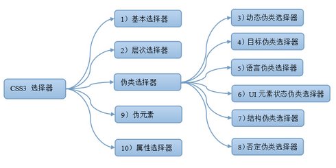

# CSS选择器

在 CSS 中，选择器是一种模式，用于选择需要添加样式的元素。

## 分类

1. 基本选择器

   | **选择器**          | **类型**   | **功能描述**                                         |
   | ------------------- | ---------- | ---------------------------------------------------- |
   | *                   | 通配选择器 | 选择文档中所有HTML元素                               |
   | E                   | 元素选择器 | 选择指定类型的HTML元素                               |
   | #id                 | ID选择器   | 选择指定ID属性值为“id”的任意类型元素                 |
   | .class              | 类选择器   | 选择指定class属性值为“class”的任意类型的任意多个元素 |
   | selector1,selectorN | 群组选择器 | 将每一个选择器匹配的元素集合并                       |

2. 层次选择器

   | **选择器** | **类型**                 | **功能描述**                                          |
   | ---------- | ------------------------ | ----------------------------------------------------- |
   | E  F       | 后代选择器（包含选择器） | 选择匹配的F元素，且匹配的F元素被包含在匹配的E元素内   |
   | E>F        | 子选择器                 | 选择匹配的F元素，且匹配的F元素所匹配的E元素的子元素   |
   | E+F        | 相邻兄弟选择器           | 选择匹配的F元素，且匹配的F元素紧位于匹配的E元素的后面 |
   | E~F        | 通用选择器               | 选择匹配的F元素，且位于匹配的E元素后的所有匹配的F元素 |

3. 伪类选择器

   - 动态伪类选择器

     | **选择器** | **类型**       | **功能描述**                                                 |
     | ---------- | -------------- | ------------------------------------------------------------ |
     | E:link     | 链接伪类选择器 | 选择匹配的E元素，而且匹配元素被定义了超链接并未被访问过。常用于链接描点上 |
     | E:visited  | 链接伪类选择器 | 选择匹配的E元素，而且匹配元素被定义了超链接并已被访问过。常用于链接描点上 |
     | E:active   | 用户行为选择器 | 选择匹配的E元素，且匹配元素被激活。常用于链接描点和按钮上    |
     | E:hover    | 用户行为选择器 | 选择匹配的E元素，且用户鼠标停留在元素E上。IE6及以下浏览器仅支持a:hover |
     | E:focus    | 用户行为选择器 | 选择匹配的E元素，而且匹配元素获取焦点                        |

   - 目标伪类选择器

     https://www.w3school.com.cn/cssref/selector_target.asp

     | **选择器** | **功能描述**                                                 |
     | ---------- | ------------------------------------------------------------ |
     | E:target   | URL 带有后面跟有锚名称 #，指向文档内某个具体的元素。这个被链接的元素就是目标元素(target element)。 |

   - 语言伪类选择器

     https://www.w3school.com.cn/cssref/selector_lang.asp

     | **选择器** | **功能描述**                                     |
     | ---------- | ------------------------------------------------ |
     | E:lang(en) | 选择带有以 "en" 开头的 lang 属性值的每个E 元素。 |

   - UI元素状态伪类选择器

     | **选择器** | **类型**             | **功能描述**                           |
     | ---------- | -------------------- | -------------------------------------- |
     | E:checked  | 选中状态伪类选择器   | 匹配选中的复选按钮或者单选按钮表单元素 |
     | E:enabled  | 启用状态伪类选择器   | 匹配所有启用的表单元素                 |
     | E:disabled | 不可用状态伪类选择器 | 匹配所有禁用的表单元素                 |

   - 结构伪类选择器

     | **选择器**            | **功能描述**                                                 |
     | --------------------- | ------------------------------------------------------------ |
     | E:first-child         | 作为父元素的第一个子元素的元素E。与E:nth-child(1)等同        |
     | E:last-child          | 作为父元素的最后一个子元素的元素E。与E:nth-last-child(1)等同 |
     | E:root                | 选择匹配元素E所在文档的根元素。在HTML文档中，根元素始终是html，此时该选择器与html类型选择器匹配的内容相同 |
     | E F:nth-child(n)      | 选择父元素E的第n个子元素F。其中n可以是整数（1，2，3）、关键字（even，odd）、可以是公式（2n+1）,而且n值起始值为1，而不是0. |
     | E F:nth-last-child(n) | 选择父元素E的倒数第n个子元素F。此选择器与E:nth-child(n)选择器计算顺序刚好相反，但使用方法都是一样的，其中：nth-last-child(1)始终匹配最后一个元素，与last-child等同 |
     | E:nth-of-type(n)      | 选择父元素内具有指定类型的第n个E元素                         |
     | E:nth-last-of-type(n) | 选择父元素内具有指定类型的倒数第n个E元素                     |
     | E:first-of-type       | 选择父元素内具有指定类型的第一个E元素，与E:nth-of-type(1)等同 |
     | E:last-of-type        | 选择父元素内具有指定类型的最后一个E元素，与E:nth-last-of-type(1)等同 |
     | E:only-child          | 选择父元素只包含一个子元素，且该子元素匹配E元素              |
     | E:only-of-type        | 选择父元素只包含一个同类型子元素，且该子元素匹配E元素        |
     | E:empty               | 选择没有子元素的元素，而且该元素也不包含任何文本节点         |

   - 否定伪类选择器

     | **选择器** | **功能描述**             |
     | ---------- | ------------------------ |
     | E:not(F)   | 匹配所有除元素F外的E元素 |

4. 伪元素选择器

   伪元素的效果是需要通过添加一个实际的元素才能达到的。

   | **选择器**      | **功能描述**                              |
   | --------------- | ----------------------------------------- |
   | E::first-line   | 为E元素第一行文字使用样式                 |
   | E::first-letter | 为E元素中的文字的首字母或第一个字使用样式 |
   | E::before       | 在E元素之前插入一些内容。                 |
   | E::after        | 在E元素之后插入一些内容                   |

5. 属性选择器

   | **选择器**              | **功能描述**                                                 |
   | ----------------------- | ------------------------------------------------------------ |
   | [*attribute*]           | 用于选取带有指定属性的元素。                                 |
   | [*attribute*=*value*]   | 用于选取带有指定属性和值的元素。                             |
   | [*attribute*~=*value*]  | 用于选取属性值中包含指定词汇的元素。                         |
   | [*attribute*\|=*value*] | 用于选取带有以指定值开头的属性值的元素，该值必须是整个单词。 |
   | [*attribute*^=*value*]  | 匹配属性值以指定值开头的每个元素。                           |
   | [*attribute*$=*value*]  | 匹配属性值以指定值结尾的每个元素。                           |
   | [*attribute**=*value*]  | 匹配属性值中包含指定值的每个元素。                           |

## 参考

https://www.w3cschool.cn/css3/css3-selector.html